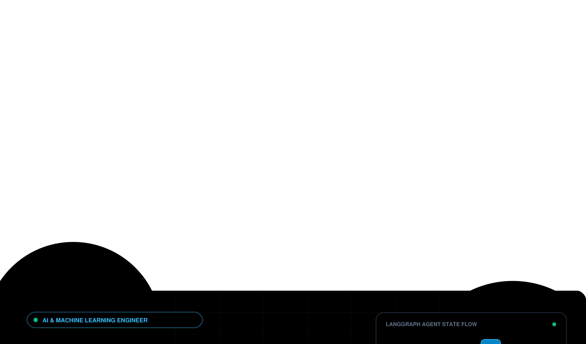

  

 

<!-- Executive Summary -->
<table width="100%">
  <tr>
    <td>
      <h3>👤 Executive Summary</h3>
      

        AI & ML Engineer specializing in <b>Generative AI</b>, <b>Agentic Workflows</b>, and <b>Retrieval-Augmented Generation (RAG)</b>. Experienced in designing state-based LLM orchestration engines, context-aware conversational agents, and natural language data analytics platforms using <b>Python, LangChain, LangGraph,</b> and <b>Google Gemini APIs</b>.
      

      <ul>
        <li>🎓 <b>Education:</b> B.Tech in Artificial Intelligence & Machine Learning — R.M.D Engineering College (2024 – 2028)</li>
        <li>💼 <b>Experience:</b> Gen AI with Agentic AI Intern — Nacre Software Services Pvt. Ltd.</li>
        <li>📍 <b>Location:</b> Andhra Pradesh, India</li>
        <li>📫 <b>Contact:</b> <a href="mailto:harshaaradhyula07@gmail.com">harshaaradhyula07@gmail.com</a></li>
      </ul>
    </td>
  </tr>
</table>

---

## 🎯 Technical Core Competencies

<table width="100%">
  <tr>
    <td width="33%" valign="top">
      <h4>🤖 Agentic AI & Orchestration</h4>
      <ul>
        <li>LangGraph State Graphs</li>
        <li>Multi-Step LLM Routing</li>
        <li>Conditional Edge Execution</li>
        <li>Autonomous Workflow Agents</li>
      </ul>
    </td>
    <td width="33%" valign="top">
      <h4>⚡ RAG & Semantic Retrieval</h4>
      <ul>
        <li>Vector DB Indexing</li>
        <li>Document Ingestion & Chunking</li>
        <li>Embeddings Generation</li>
        <li>Context-Aware Document QA</li>
      </ul>
    </td>
    <td width="34%" valign="top">
      <h4>📊 Data Analytics & AI/ML</h4>
      <ul>
        <li>Automated EDA & Profiling</li>
        <li>Statistical Data Insights</li>
        <li>Model Evaluation</li>
        <li>Python, Pandas, NumPy</li>
      </ul>
    </td>
  </tr>
</table>

---

## 💻 Featured AI Projects

<table>
  <thead>
    <tr>
      <th width="32%">Project Repository</th>
      <th width="28%">Technologies Used</th>
      <th width="40%">Architecture & Engineering Highlights</th>
    </tr>
  </thead>
  <tbody>
    <tr>
      <td>
        <b><a href="https://github.com/A-harsha-a/langgraph-fundamentals">🔗 State-Based AI Workflow Engine</a></b>
      </td>
      <td>
        <code>LangGraph</code> <code>Python</code> 
        <code>LLMs</code> <code>Agentic AI</code>
      </td>
      <td>
        Engineered stateful, multi-step LLM workflows using LangGraph. Implemented node-based execution graphs, conditional routing, and agentic decision-making logic.
      </td>
    </tr>
    <tr>
      <td>
        <b><a href="https://github.com/A-harsha-a/pdf-rag-using-langchain">🔗 LLM-Powered PDF QA System (RAG)</a></b>
      </td>
      <td>
        <code>LangChain</code> <code>Gemini API</code> 
        <code>ChromaDB</code> <code>RAG</code>
      </td>
      <td>
        Architected an end-to-end Retrieval-Augmented Generation pipeline for PDF documents. Integrated semantic vector indexing with Gemini API for precise document QA.
      </td>
    </tr>
    <tr>
      <td>
        <b><a href="https://github.com/A-harsha-a/langchain-gemini-chatbot">🔗 Conversational AI Chatbot</a></b>
      </td>
      <td>
        <code>LangChain</code> <code>Gemini API</code> 
        <code>Conversation Memory</code>
      </td>
      <td>
        Developed a context-aware chatbot separating prompt management, model invocation, and response generation into reusable, modular software layers.
      </td>
    </tr>
    <tr>
      <td>
        <b><a href="https://github.com/A-harsha-a/llm-powered-EDA">🔗 Natural Language Data Analysis</a></b>
      </td>
      <td>
        <code>Gemini API</code> <code>Python</code> 
        <code>Pandas</code> <code>EDA</code>
      </td>
      <td>
        Built an automated exploratory data analysis tool allowing non-technical users to query structured datasets using natural language without writing SQL or Python.
      </td>
    </tr>
  </tbody>
</table>

---

## 🛠️ Technology Stack

  
<b>🤖 AI, Frameworks & Vector Databases</b>

   
  
  
  
  
  
  

  
<b>💻 Languages & Data Science</b>

   
  
  
  
  
  
  

  
<b>🔧 Development Tools & Infrastructure</b>

   
  
  
  
  
  
  

---

## 📊 Skill Matrix & Proficiency Levels

| Technical Domain | Proficiency Rating | Core Tools & Frameworks | Focus & Application Areas |
| :--- | :---: | :--- | :--- |
| **Generative AI & LLMs** | `Intermediate` | LangChain, LangGraph, Gemini API, LlamaIndex | Autonomous Agents, Stateful Workflows, Chatbots |
| **RAG Architectures** | `Intermediate` | ChromaDB, Qdrant, Vector Embeddings | Semantic Search, Document QA Systems |
| **Python Development** | `Advanced` | Python 3, Pandas, NumPy, Scikit-Learn | Data Profiling, ML Pipelines, EDA |
| **Databases & Vector Stores** | `Intermediate` | SQL, MongoDB, ChromaDB, Qdrant | Vector Indexing, Relational Schema Design |
| **Interactive Demos & UI** | `Intermediate` | Streamlit, Gradio | Data Apps, AI Demos, Interactive Dashboards |
| **Core Languages** | `Proficient` | Python, Java, C++ | Data Structures, Algorithms, OOP Design |

---

## 🏆 Professional Certifications & Qualifications

<table>
  <thead>
    <tr>
      <th>Issuing Organization</th>
      <th>Certification / Professional Qualification</th>
    </tr>
  </thead>
  <tbody>
    <tr>
      <td><b>Oracle</b></td>
      <td>APEX Cloud Developer Certified Professional</td>
    </tr>
    <tr>
      <td><b>Oracle</b></td>
      <td>Generative AI Certified Professional</td>
    </tr>
    <tr>
      <td><b>Oracle</b></td>
      <td>Agentic AI Certified Foundations Associate</td>
    </tr>
    <tr>
      <td><b>Google</b></td>
      <td>AI Essentials Certification</td>
    </tr>
    <tr>
      <td><b>Google</b></td>
      <td>Innovating with Google Cloud AI Certification</td>
    </tr>
    <tr>
      <td><b>IIT Kharagpur</b></td>
      <td>Database Management System (DBMS) Certification</td>
    </tr>
  </tbody>
</table>

---

## 🌐 Connect & Professional Network

  
  &nbsp;&nbsp;
  
  &nbsp;&nbsp;
  

    
  Aradhyula Purna Naga Sri Harsha © 2026 • AI & ML Engineer Profile

